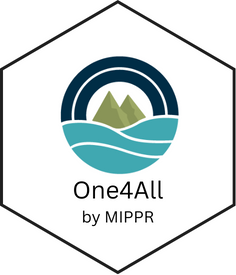

# **One4All** <a href="https://moore-institute-4-plastic-pollution-res.github.io/One4All/"></a>

<!-- badges: start -->
[](https://CRAN.R-project.org/package=One4All)
[](https://github.com/Moore-Institute-4-Plastic-Pollution-Res/One4All/actions/workflows/R-CMD-check.yaml)
[](https://opensource.org/license/mit)
[](https://openanalysis.org/microplastic_data_portal/)
<!-- badges: end -->

## Overview
The One4All portal was designed to streamline data validation and formatting tasks. Its primary function is to read a set of rules from a 'CSV' or 'Excel' file to validate a dataset.

The package functions and shiny application also helps in creating valid 'Excel' files with conditional formatting based on specified rules, making it easier to identify and manage inconsistencies in data. Overall, the One4All portal aims to enhance data validation and management processes for a more efficient and accurate workflow.

Users have the option to work in the R shiny application or the R package. The functionality in the validator app is based on the One4All package.

## Installation

**One4All** is available from CRAN and GitHub.

### Get the released version from CRAN:
```r
install.packages("One4All")
```

### Or the development version from GitHub:
``` r
# install.packages("remotes")
remotes::install_github("Moore-Institute-4-Plastic-Pollution-Res/One4All")
```

### Access the validator tool below:
- Click here for the web app: [openanalysis.org/microplastic_data_portal/](https://openanalysis.org/microplastic_data_portal/).

- The code for the app is in [code/validator](https://github.com/Moore-Institute-4-Plastic-Pollution-Res/One4All/tree/main/code/validator)

## Getting Started
``` r
library(One4All)
```

## Additional Instructions

Access the pkgdown and vignettes here: https://moore-institute-4-plastic-pollution-res.github.io/One4All/ 

## Contributing

Contributions to One4All are welcome!

- Some ideas on [How to Contribute](https://opensource.guide/how-to-contribute/).
- Please adhere to this project's [Code of Conduct](https://www.contributor-covenant.org/version/2/1/code_of_conduct/).
- Open an [issue](https://github.com/Moore-Institute-4-Plastic-Pollution-Res/One4All/issues) or [pull request](https://github.com/Moore-Institute-4-Plastic-Pollution-Res/One4All/pulls) here.

## License

One4All is released under the MIT License. Please see the license file for more information. 
