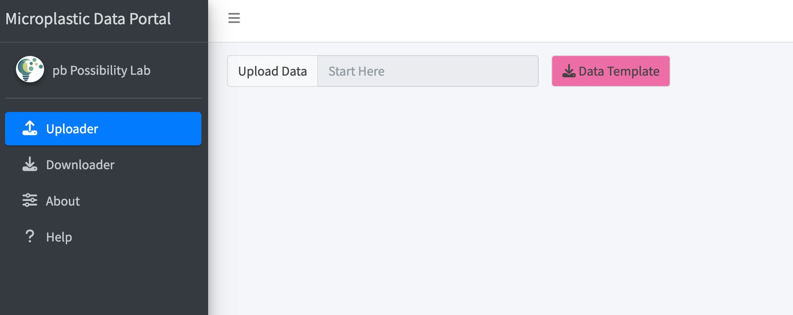
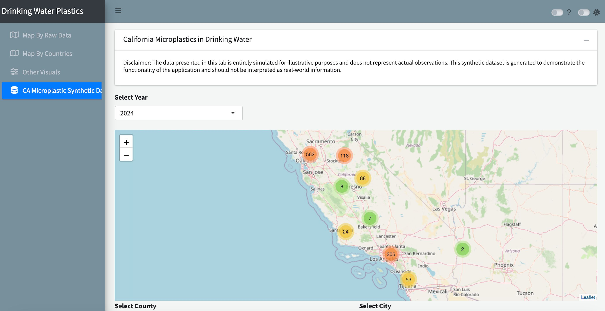
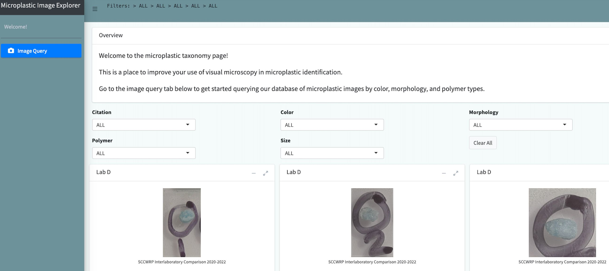

# **One4All** <a href="https://moore-institute-4-plastic-pollution-res.github.io/One4All/"></a>

<!-- badges: start -->
[](https://CRAN.R-project.org/package=One4All)
[](https://github.com/Moore-Institute-4-Plastic-Pollution-Res/One4All/actions/workflows/R-CMD-check.yaml)
[](https://opensource.org/license/mit)
[](https://openanalysis.org/microplastic_data_portal/)
<!-- badges: end -->

## Overview
The One4All portal was designed to streamline data validation and formatting tasks. Its primary function is to read a set of rules from a 'CSV' or 'Excel' file to validate a dataset.

The package functions and Validator Tool also aid in creating valid 'Excel' files with conditional formatting based on specified rules, making it easier to identify and manage inconsistencies in data. Overall, the One4All portal aims to enhance data validation and management processes for a more efficient and accurate workflow.

Additionally, the One4All package has a variety of functionality and has been integrated in the Data Visualization Tool and the Microplastic Image Explorer, both available for use in this repository (see below).

## Installation

**One4All** is available from CRAN and GitHub.

### Get the released version from CRAN:
```r
install.packages("One4All")
```

### Or the development version from GitHub:
``` r
# install.packages("remotes")
remotes::install_github("Moore-Institute-4-Plastic-Pollution-Res/One4All")
```

### Getting Started
```r
library(One4All)
```

### Tools

Users can run each of the tools using this function and replacing the app name:
```r
run_app(app = "validator")
```
```r
run_app(app = "data_visualization")
```
```r
run_app(app = "microplastic_image_explorer")
```

---

#### Data Validator
Data validation is essential before sharing data widely. The functionality of the Validator app is based on the One4All package [](https://CRAN.R-project.org/package=One4All) [](https://openanalysis.org/microplastic_data_portal/).



If using the web app:

- Go to [openanalysis.org/one4all](https://openanalysis.org/microplastic_data_portal/).
- The code for the app is in [/inst/apps/validator](https://github.com/Moore-Institute-4-Plastic-Pollution-Res/One4All/tree/main/inst/apps/validator).

---

#### Data Visualization
The Data Visualization Tool allows users to analyze microplastics data through maps, plots, and tables. We also aim to integrate shared data from the Validator tool. The code for the app is in [/inst/apps/data_visualization](https://github.com/Moore-Institute-4-Plastic-Pollution-Res/One4All/tree/main/inst/apps/data_visualization).

- To get started with the tool, go to [openanalysis.org/microplastic_analysis](https://openanalysis.org/microplastic_analysis/). 



---

#### Microplastic Image Explorer
The Microplastic Image Explorer allows users to query microplastic images from our database by selecting filters. Users can apply more than one filter from citation, color, morphology, and/or polymer. The code for the app is in [/inst/apps/microplastic_image_explorer](https://github.com/Moore-Institute-4-Plastic-Pollution-Res/One4All/tree/main/inst/apps/microplastic_image_explorer).

- To get started with the tool, go to [openanalysis.org/microplastic_image_explorer](https://openanalysis.org/microplastic_image_explorer/). 



---

## Additional Instructions

Access the pkgdown and vignettes here: https://moore-institute-4-plastic-pollution-res.github.io/One4All/ 

## Contributing

Contributions to One4All are welcome!

- Some ideas on [How to Contribute](https://opensource.guide/how-to-contribute/).
- Please adhere to this project's [Code of Conduct](https://www.contributor-covenant.org/version/2/1/code_of_conduct/).
- Open an [issue](https://github.com/Moore-Institute-4-Plastic-Pollution-Res/One4All/issues) or [pull request](https://github.com/Moore-Institute-4-Plastic-Pollution-Res/One4All/pulls) here.

## License

One4All is released under the MIT License. Please see the license file for more information. 
