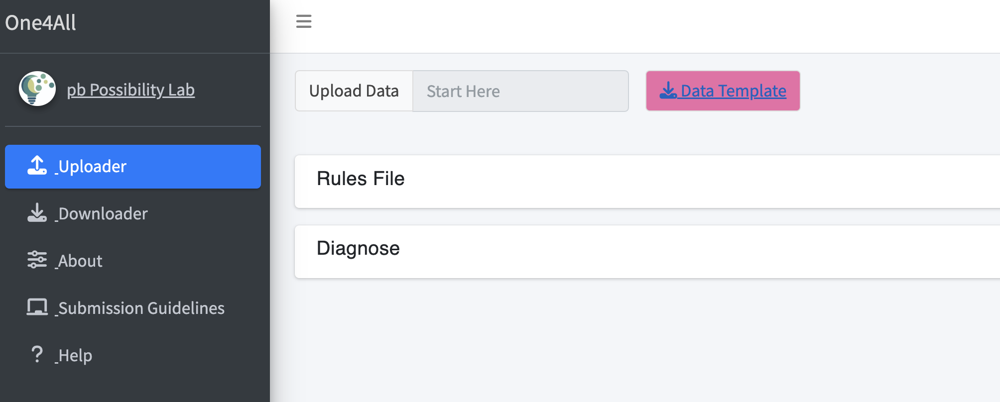
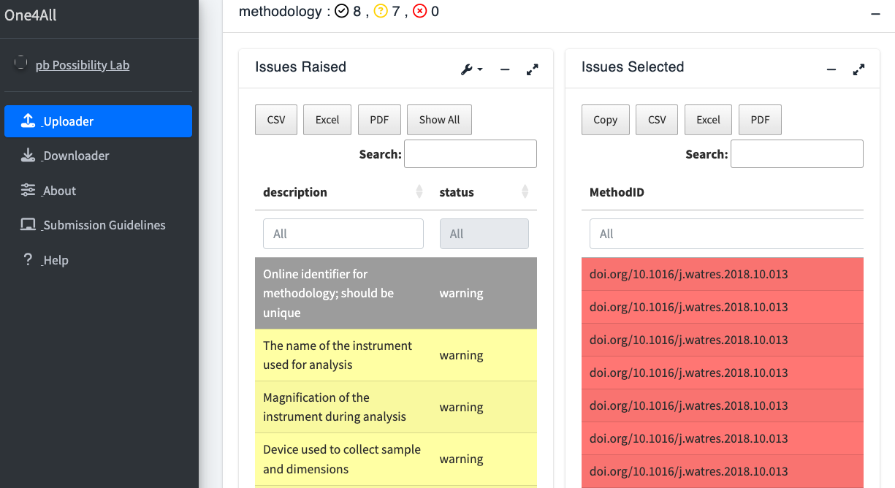
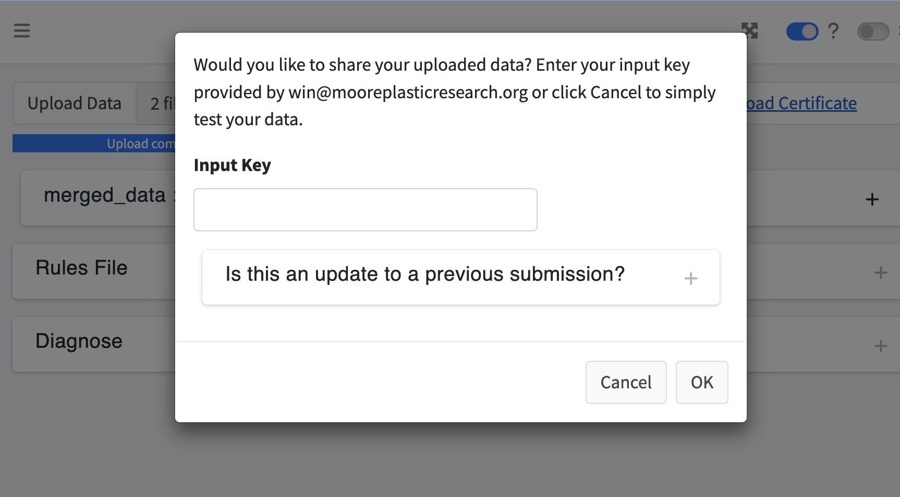
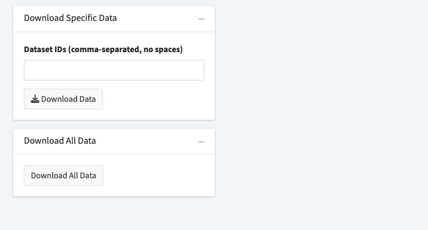

# Summary

Microplastics are a diverse suite of contaminants [@Rochman:2019] requiring a variety of data types to capture particle characteristics and study methodologies [@Jenkins:2022; @California:2022]. Data sharing is critical to advance science and policy [@Coffin:2023]. The One4All portal was created to harmonize and share structured and unstructured microplastic data (and beyond) through validation. Validated data can be automatically uploaded to the following cloud services: Amazon S3, CKAN, and/or MongoDB. One4All is both a graphical user interface (GUI) and an R package and can be used for applications outside of microplastics. This manuscript provides information about the usage, workflow, and configuration of One4All, emphasizing its adaptability for diverse purposes.

# Statement of need

In the realm of scientific advancement, the ability to reuse data and reproduce results is paramount, as highlighted by @Peng:2011. For example, the National Center for Biotechnology Information (NCBI)'s gene databank contains over 3 billion records and is considered a critical component of biological research. Ample funding and attention has been directed toward the study of the human genome for decades, while plastic pollution, particularly microplastics, has only recently begun to receive this attention. The challenge in effectively sharing data, however, lies in the varied structuring and formatting of data across different research areas, especially in emerging fields such as plastic pollution. This inconsistency slows progress and results in inefficient use of resources to make disparate datasets compatible for analysis and decision making. For instance, the burgeoning field of microplastic pollution monitoring faces significant hurdles due to varied data collection methods, environmental matrices, and analytical approaches, leading to a lack of standardized data formats [@Lu:2021; @Hapich:2022; @Fox:2024; @Dissanayake:2022]. Although there are efforts towards creating databases, such as Čerkasova et al.'s public database for environmental microplastics [@Cerkasova:2023], widespread adoption of standardized data formats remains elusive.

Several key aspects are required to ensure widespread adoption of a unified data reporting structure: the adoption of FAIR data principles—making data Findable, Accessible, Interoperable, and Reusable; ease of use; and field-based standards and/or regulatory guidance. By integrating FAIR principles, we propose the development of One4All, a user-friendly, open-source portal designed to validate, share, and make microplastics monitoring data accessible to any researcher in a structured format via a web browser. One4All can also be used locally, independent of a web browser, through the use of its package functions. This platform aims to support the transparent, reproducible, and flexible exchange of data across scientific communities, thereby fostering collaboration among researchers, regulators, and policymakers [@SimonSanchez:2022; @Coffin:2021; @Cowger:2023; @Jenkins:2022]. Although One4All is the general framework, the [Microplastics Data Portal](https://github.com/Moore-Institute-4-Plastic-Pollution-Res/Microplastic_Data_Portal) is a specific implementation designed for microplastics data [@Cowger:2020]. This data portal was created on the basis of open-source resources, supporting the implementation of the California Senate Bill (SB) No. 1422 (2017-2018), which mandates sharing of microplastics data from drinking water [@Coffin:2023]. Additionally, the [Microplastics Data Portal](https://github.com/Moore-Institute-4-Plastic-Pollution-Res/Microplastic_Data_Portal) has been legislatively established and will be mandated to be used by public water systems and accredited microplastic labs [@California:2022]. While One4All was initially developed to serve as a resource and regulatory reporting standard for the USA State of California’s monitoring campaign for microplastics, it can also be utilized by any researcher, enabling greater harmonization amongst researchers across the globe. One4All represents a pivotal step towards standardizing data in rapidly evolving research areas, and by being responsive to user needs, enabling more effective and collaborative scientific inquiry.

# Demo

A full tutorial video is available on [YouTube](https://www.youtube.com/embed/LMpf5-K_tYQ). For additional instructions, access the pkgdown and vignettes here: (https://moore-institute-4-plastic-pollution-res.github.io/One4All/).

# Method

## Workflow Overview

Consisting of an R package and an R shiny application, this portal was designed to enhance data validation and management processes by employing a set of functions that read a set of rules from a ‘CSV’ or ‘Excel’ file to validate a dataset. Users have the option to work in the validator app or the One4All package. The functionality in the validator app is based on the One4All package (Figure 1). 


The set of rules comes from a [rules sheet](https://github.com/Moore-Institute-4-Plastic-Pollution-Res/One4All/blob/main/inst/apps/validator/www/rules_dw_acc.csv), which is a 'CSV' file that contains the following fields: name, description, dataset, valid example, severity, and rule. Users should add the rules as R functions, referring to the column names in the uploaded data. The dataset is an optional field when the file is separated into multiple sheets or files (Figure 2).


The rules sheet and configuration file (explained below) power the application and package functions to validate, share, and download data. 

Structure a [configuration file](https://github.com/Moore-Institute-4-Plastic-Pollution-Res/One4All/blob/main/inst/apps/validator/example_config.yml) using the template from the One4All portal. Replace the hashed placeholders with your information to determine fields such as where to share and download the data. An additional layer of security can be implemented by creating a valid key which will require users to provide an input key when sharing or downloading validated data. Users can request an input key from the maintainer listed in the configuration file under 'contact'.

```yaml
default:
    # valid_key_share: "your_valid_key_share"
    # valid_key_download: "your_valid_key_download"
    # valid_rules: "your_valid_rules"
    # ckan_key: "your_ckan_key"
    # ckan_url: "your_ckan_url"
    # ckan_package: "your_ckan_package"
    # ckan_url_to_send: "your_ckan_url_to_send"
    portal_name: "One4All"
    portal_funder_name: !expr shiny::tags$a(href = "https://possibilitylab.berkeley.edu/", "pb Possibility Lab")
    portal_funder_link: "https://pbs.twimg.com/profile_images/1540022027288924160/bn2627cY_400x400.jpg"
    # s3_username: "your_s3_username"
    # s3_key_id: "your_s3_key_id"
    # s3_secret_key: "your_s3_secret_key"
    # s3_console_link: "your_s3_console_link"
    # s3_region: "your_s3_region"
    # s3_bucket: "your_s3_bucket"
    # mongo_key: "your_mongo_key"
    # mongo_collection: "your_mongo_collection"
    # apiKey: "your_mongo_apikey"
    rules_to_use: "www/rules_dw_acc.csv"
    rules_example: "www/rules_dw_acc.csv"
    valid_data_example: !expr c("www/data.xlsx", "www/extra_files.zip")
    invalid_data_example: !expr c("www/data_example_errors.xlsx", "www/example_files_errors.zip")
    twitter: "https://twitter.com/Win_OpenData"
    github:  "https://github.com/Moore-Institute-4-Plastic-Pollution-Res/One4All/tree/main/inst/apps/validator"
    license: "https://opensource.org/license/mit"
    contact: "win@mooreplasticresearch.org"
    dev: TRUE
    tutorial: "https://www.youtube.com/embed/LMpf5-K_tYQ"
    overview: "https://www.youtube.com/embed/GKsoNega7CY"
    google_form_link: "https://forms.gle/kMEjpceuSRREJeYR8"
```

## How to use the app:

Users will first validate their data by uploading a ‘CSV’ or ‘Excel’ file, and a corresponding zip folder consisting of the unstructured data (Figure 3). 



If there are any invalid data, errors and warnings will be highlighted on the following screen. The ‘Issues Raised’ box identifies which fields resulted in an error or warning, along with a description of the error or warning. The ‘Issues Selected’ box identifies which cells were invalid. Correct the invalid data entries and reupload the ‘CSV’ or ‘Excel’ file along with the corresponding zip folder (Figure 4).



Users have the option to upload their validated data to the previously mentioned cloud services, based on the credentials provided in the configuration file. To share data, provide an input key from the configuration file, if required. Additionally, upload a certificate if updating a previous submission (Figure 5).



Once successfully shared, a confirmation screen will be generated and the data will be uploaded to the appropriate cloud services. Users can download a certificate at the top right corner to view the credentials of their submission (Figure 6).


Users also have the option to download any previously uploaded data from the cloud services. Users can download one dataset at a time, providing the dataset ID from a downloaded certificate, or choose to download all data (Figure 7). 



## How to use the package:

The features in the validator app are based on the One4All package functions. The overarching goal of providing the package functions is to allow users the option of working in the application and/or the package and to allow the functions to be reused in contexts beyond the scope of One4All for the user's purposes.

First, load the One4All library, then optionally run the app using the ‘run_app()’ function.

```r
library(One4All)
run_app()
```

Validate data using the ‘validate_data’ function. Replace ‘files_data’, ‘data_names’, and ‘file_rules’ with your values.

```r
result_valid <- validate_data(files_data = valid_example,
                data_names = c("methodology", "particles", "samples"),
                file_rules = test_rules)
```

Identify errors and warnings using the ‘rules_broken’ function. Replace the ‘results’ and ‘show_decision’ parameters with your values. This function filters the validation results to show only the broken rules, optionally including successful decisions as well.

```r
broken_rules <- rules_broken(results, show_decision)
```

Share your validated data to the cloud services using the ‘remote_share’ function. Ensure that your data are validated before sharing your data. Replace the pertaining placeholders with your information.

```r
shared_data <- remote_share(validation = result_valid,
                data_formatted = result_valid$data_formatted,
                files = test_file,
                verified = "your_verified_key",
                valid_key_share = "your_valid_key_share",
                valid_rules = digest::digest(test_rules),
                ckan_url = "https://example.com",
                ckan_key = "your_ckan_key",
                ckan_package = "your_ckan_package",
                url_to_send = "https://your-url-to-send.com",
                rules = test_rules,
                results = valid_example$results,
                s3_key_id = "your_s3_key_id",
                s3_secret_key = "your_s3_secret_key",
                s3_region = "your_s3_region",
                s3_bucket = "your_s3_bucket",
                mongo_key = "your_mongo_key",
                mongo_collection = "your_mongo_collection",
                old_cert = NULL)
```

Download data from the cloud services using the ‘remote_download’ function. Replace the pertaining placeholders with your information.

```r
downloaded_data <- remote_download(hashed_data = "example_hash",
                    ckan_url = "https://example.com",
                    ckan_key = "your_ckan_key",
                    ckan_package = "your_ckan_package",
                    s3_key_id = "your_s3_key_id",
                    s3_secret_key = "your_s3_secret_key",
                    s3_region = "your_s3_region",
                    s3_bucket = "your_s3_bucket",
                    mongo_key = "mongo_key",
                    mongo_collection = "mongo_collection")
```

## Limitations:

The main limitation is finding a balance between expanding the variety of rules to broaden the tool's usability and maintaining efficient collaboration among researchers. The current rules implemented in the One4All portal encompass a wide variety of microplastics data, but those rules are limited to microplastics. To accept a wider variety of data, or to use the tool for an entirely different purpose, additional rules sheets will need to be created with variables pertaining to the other fields. However, the more variables added to a rules sheet, the more complex the overall QA/QC compliance pathway, increasing the chances of data entry errors. Because of this, it is important to find a balance that encompasses a wide enough range of data so users beyond microplastics data are able to use this application, but maintain a limit so that collaboration among researchers is still efficient and easy. 

# Availability and Documentation:

One4All is published on CRAN and was created in R(4.2.1) [@R:2022] using the following libraries: shiny [@Shiny:2023], dplyr [@Dplyr:2023], validate [@Validate:2021], digest [@Digest:2023], data.table [@Datatable:2023], ckanr [@Ckanr:2023], openxlsx [@Openxlsx:2023], lexicon [@Lexicon:2018], readr [@Readr:2023], readxl [@Readxl:2023], tibble [@Tibble:2023], aws.s3 [@Awss3:2020], rlang [@Rlang:2023], jsonlite [@Jsonlite:2014], mongolite [@Jsonlite:2014], and httr [@Httr:2023]. The validator app is hosted on the web at [openanalysis.org/one4all/](https://openanalysis.org/one4all/). The source code is [available on GitHub](https://github.com/Moore-Institute-4-Plastic-Pollution-Res/One4All) with an [MIT License](https://opensource.org/license/mit). The source code can be run offline on any machine that can install the One4All package. This package is maintained by the Moore Institute for Plastic Pollution Research on GitHub and is updated with each release.

# Future Goals

The One4All portal is intended to be useful for users to validate and share their data. Our goal is to promote open-source resources for the public and update the software with other resources that have yet to be implemented. We plan to integrate Open Specy, developed by @Cowger:2021, for users to validate their spectra submissions before submitting to the Open Specy reference library. Additionally, we plan to incorporate the [Data Visualization Tool](https://github.com/Moore-Institute-4-Plastic-Pollution-Res/One4All/tree/main/inst/apps/data_visualization) and the [Microplastic Image Explorer](https://github.com/Moore-Institute-4-Plastic-Pollution-Res/One4All/tree/main/inst/apps/microplastic_image_explorer), both sourced from the [Microplastics Data Portal](https://github.com/Moore-Institute-4-Plastic-Pollution-Res/Microplastic_Data_Portal), to increase discoverability and adhere to FAIR data principles. For the [Data Visualization Tool](https://github.com/Moore-Institute-4-Plastic-Pollution-Res/One4All/tree/main/inst/apps/data_visualization), we intend to utilize an API key generated from the cloud services within the One4All to integrate shared data, enabling the tool to visually represent the shared data through maps, plots, and tables. Our objective for the [Microplastic Image Explorer](https://github.com/Moore-Institute-4-Plastic-Pollution-Res/One4All/tree/main/inst/apps/microplastic_image_explorer) is to validate datasets containing microplastic images before integrating them into the tool’s database. Similarly, we can collect data for Trash AI, a GUI that identifies individual items of trash within images, by validating datasets containing images of trash before uploading them [@TrashAI:2023]. Furthermore, we aim to expand our current set of rules by incorporating AI strategies such as ChatGPT [@ChatGPT:2024] to generate rule templates for macroplastics or other pollutants. This will provide users the option to create rule templates using AI strategies as well.

# Acknowledgments

We acknowledge and greatly appreciate the financial support from the National Renewable Energy Laboratory and the Possibility Lab. The Moore Institute for Plastic Pollution Research led the development of the software tool and drafting of this manuscript. The One4All portal was inspired by the Data Validator tool created by Appsilon. We acknowledge the work and the input of the San Francisco Estuary Institute and the California State Water Resources Control Board. We would like to thank Scott Coffin, Tony Hale, Diana Lin, Gemma Shusterman, Rebecca Sutton, Adam Wong, Richard Nelson, Leah Thornton Hampton, Libby Heeren, and Gabriel Daiess. We would also like to thank Anja Oca, Haig Minasian, and Holden Ford from California State University, Long Beach, who provided the valid sample data used in the validator application. The views and opinions expressed in this article are those of the authors and do not necessarily reflect the official policy or position of any California State agency.

# References