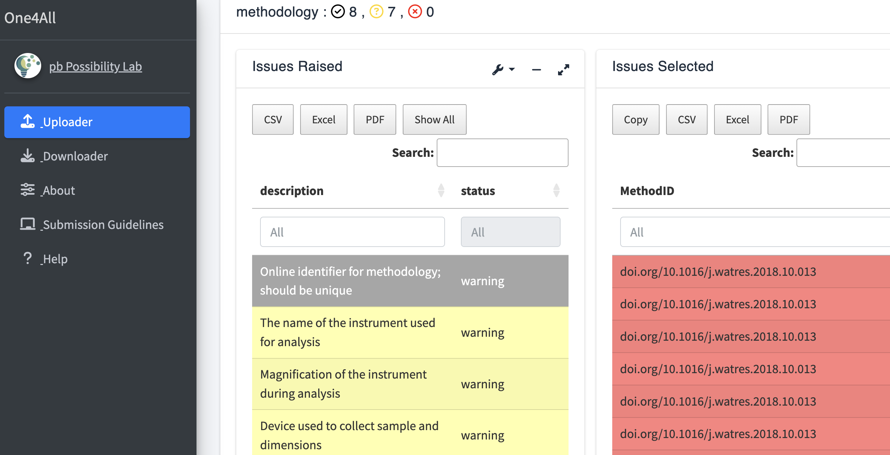
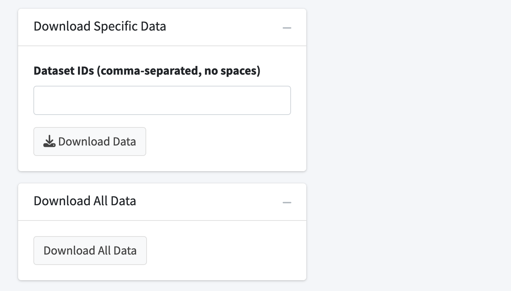
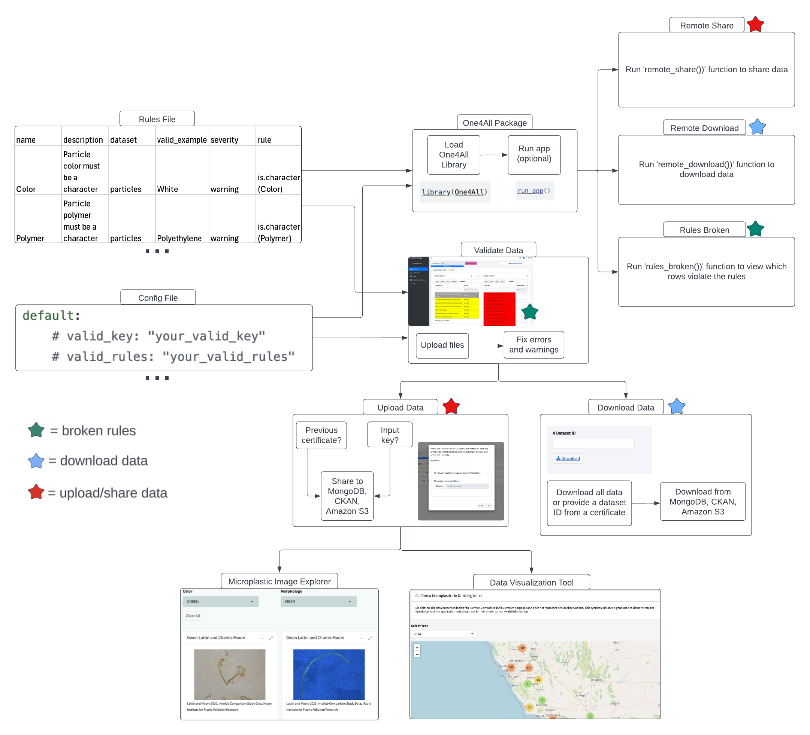

# Summary

Microplastics are a diverse suite of contaminants [@Rochman:2019] resulting in a variety of data [@Jenkins:2022; @California:2022]. Data sharing is critical to advance science and policy [@Coffin:2023]. The One4All portal was created to standardize and share structured and unstructured microplastic data (and beyond) through validation. Validated data can be automatically uploaded to the following cloud services: Amazon S3, CKAN, and/or MongoDB. One4All is both a graphic user interface and an R package and can be used for applications outside of microplastics. This manuscript provides information about the usage, workflow, and configuration of the One4All.

# Statement of need

In the realm of scientific advancement, the ability to reuse data and reproduce results is paramount, as highlighted by @Peng:2011. For example, the National Center for Biotechnology Information (NCBI)'s gene databank contains over 3 billion records and is considered a critical component of biological research. Ample funding and attention has been directed toward the study of the human genome for decades, while plastic pollution, particularly microplastics, has only recently begun to receive this attention. The challenge in effectively sharing data, however, lies in the varied structuring and formatting of data across different research areas, especially in emerging fields such as plastic pollution. This inconsistency slows progress and results in inefficient use of resources to make disparate datasets compatible for analysis and decision making. For instance, the burgeoning field of microplastic pollution monitoring faces significant hurdles due to varied data collection methods, environmental matrices, and analytical approaches, leading to a lack of standardized data formats [@Hapich:2022; @Fox:2024; @Dissanayake:2022]. Although there are efforts towards creating databases, such as Čerkasova et al.'s public database for environmental microplastics [@Cerkasova:2023], widespread adoption of standardized data formats remains elusive.

Several key aspects are required to ensure widespread adoption of a unified data reporting structure: the adoption of FAIR data principles—making data Findable, Accessible, Interoperable, and Reusable; ease of use; and field-based standards and/or regulatory guidance. By integrating FAIR principles, we propose the development of One4All, a user-friendly, open-source portal designed to validate, share, and make microplastics monitoring data accessible to any researcher in a structured format via a web browser. This platform aims to support the transparent, reproducible, and flexible exchange of data across scientific communities, thereby fostering collaboration among researchers, regulators, and policymakers [@SimonSanchez:2022; @Coffin:2021; @Cowger:2023; @Jenkins:2022]. While One4All was initially developed to serve as a resource and regulatory reporting standard for the USA State of California’s monitoring campaign for microplastics, it is also intended to be used by any researcher anywhere in the world. One4All represents a pivotal step towards standardizing data in rapidly evolving research areas, and by being responsive to user needs, enabling more effective and collaborative scientific inquiry.

# Demo

A full tutorial video is available on [YouTube](https://www.youtube.com/embed/LMpf5-K_tYQ). For additional instructions, access the pkgdown and vignettes here: (https://moore-institute-4-plastic-pollution-res.github.io/One4All/).

# Method

## How to use the app:

Users will first validate their data by uploading a ‘CSV’ or ‘Excel’ file, and a corresponding zip folder consisting of the unstructured data (Figure 1). 

If there are any invalid data, errors and warnings will be highlighted on the following screen. The ‘Issues Raised’ box identifies which fields resulted in an error or warning, along with a description of the error or warning. The ‘Issues Selected’ box identifies which cells were invalid. Correct the invalid data entries and reupload the ‘CSV’ or ‘Excel’ file along with the corresponding zip files (Figure 2).

Users have the option to upload their validated data to the previously mentioned cloud services, based on the credentials provided in the configuration file. To share data, provide an input key from the configuration file, if required. Additionally, upload a certificate if updating a previous submission (Figure 3).

Once successfully shared, a confirmation screen will be generated and the data will be uploaded to the appropriate cloud services. Users can then download a certificate at the top right corner to view the credentials of their submission (Figure 4).

Users also have the option to download any previously uploaded data from the cloud services. Users can download one dataset at a time, providing the dataset ID from a downloaded certificate (Figure 5). 

## How to use the package:

To use the One4All package, users will first load the One4All library (Figure 6). The features in the validator app are based on the One4All package functions.

Users can validate their data using the ‘validate_data’ function, replacing the parameters with their own information (Figure 7). 

To identify errors and warnings, users can use the ‘rules_broken’ function. This function filters the validation results to show only the broken rules, optionally including successful decisions as well (Figure 8).

Once the data are validated, users can share their data to the cloud services using the ‘remote_share’ function, replacing the placeholders with their information (Figure 9). 

To download data from the cloud services, users can use the ‘remote_download’ function, replacing the placeholders with their information (Figure 10). 

## Workflow Overview

Consisting of an R package and an R shiny application, this portal was designed to enhance data validation and management processes by employing a set of functions that read a set of rules from a ‘CSV’ or ‘Excel’ file to validate a dataset. The set of rules comes from a [rules sheet](https://github.com/Moore-Institute-4-Plastic-Pollution-Res/Microplastic_Data_Portal/blob/main/code/validator/www/microplastic_images/One4AllValidator_rules.csv), which is a csv file that contains the following fields: name, description, dataset, valid example, severity, and rule. The dataset is an optional field when the file is separated into multiple sheets (Figure 11). 

Start by structuring the configuration file using the template from the [Microplastic Data Portal](https://github.com/Moore-Institute-4-Plastic-Pollution-Res/Microplastic_Data_Portal/blob/main/code/validator/example_config.yml). Replace the hashed placeholders with your information to determine fields such as where to share and download the data. An additional layer of security can be implemented by creating a ‘valid_key’ which will require users to provide an input key when sharing their validated data (Figure 12).

. Replace the hashed placeholders with your information. If a ‘valid_key’ is added, then a user will need to provide an input key to share their validated data.\label{fig:example12}](manuscriptimages/One4AllConfig.png)

Users have the option to work in the validator app or the One4All package. The functionality in the validator app is based on the One4All package (Figure 13). 

## Limitations:

The main limitation is finding a balance to incorporate a wide variety of data. The current rules implemented in the One4All portal encompass a wide variety of microplastics data, but those rules are limited to microplastics. To accept a wider variety of data, or to use the tool for an entirely different purpose, additional rules sheets will need to be created with variables pertaining to the other fields. However, the more variables added to a rules sheet, the more complex the overall QA/QC compliance pathway, increasing the chances of data entry errors. Because of this, it is important to find a balance that encompasses a wide enough range of data so users beyond microplastics data are able to use this application, but maintain a limit so that collaboration among researchers is still efficient and easy. 

# Availability and Documentation:

One4All is published on CRAN and was created in R(4.2.1) [@R:2022] using the following libraries: shiny [@Shiny:2023], dplyr [@Dplyr:2023], validate [@Validate:2021], digest [@Digest:2023], data.table [@Datatable:2023], ckanr [@Ckanr:2023], openxlsx [@Openxlsx:2023], lexicon [@Lexicon:2018], readr [@Readr:2023], readxl [@Readxl:2023], tibble [@Tibble:2023], aws.s3 [@Awss3:2020], rlang [@Rlang:2023], jsonlite [@Jsonlite:2014], mongolite [@Jsonlite:2014], and httr [@Httr:2023]. The validator app is hosted on the web at [openanalysis.org/one4all/](https://openanalysis.org/one4all/). The source code is [available on GitHub](https://github.com/Moore-Institute-4-Plastic-Pollution-Res/One4All) with a [CC-BY-4.0 license](https://creativecommons.org/licenses/by/4.0/legalcode.en). The source code can be run offline on any machine that can install the One4All package. This package is maintained by the Moore Institute for Plastic Pollution Research on GitHub and is updated with each release.

# Future Goals

The One4All portal is intended to be useful for users to validate and share their data. Our goal is to promote open-source resources for the public and update the software with other resources that have yet to be implemented. We aim to integrate Open Specy, developed by @Cowger:2021, for users to validate their spectra submissions before submitting to the Open Specy reference library. We also aim to expand our current set of rules, by incorporating AI strategies such as ChatGPT, to generate a rule template for macroplastics or other pollutants. This will provide users the option to create rule templates using AI strategies as well. We also aim to integrate the data visualization tool and the microplastic image explorer, both sourced from the Microplastic Data Portal, to increase discoverability and adhere to FAIR data principles. Our objective with the data visualization tool is to utilize an API key generated from the cloud services within the One4All to integrate the shared data. This will then enable the data visualization tool to visually represent the shared data through maps, plots, and tables. Our objective with the microplastic image explorer is to validate a dataset containing microplastic images before integrating the images into the tool’s database.

# Acknowledgments

We acknowledge and greatly appreciate the financial support from the National Renewable Energy Laboratory and the Possibility Lab. The Moore Institute for Plastic Pollution Research led the development of the software tool and drafting of this manuscript. The One4All portal was inspired by the data validator tool created by Appsilon. We acknowledge the work and the input of the San Francisco Estuary Institute and the California State Water Resources Control Board. We would like to thank Scott Coffin, Tony Hale, Diana Lin, Gemma Shusterman, Rebecca Sutton, Adam Wong, Richard Nelson, Leah Thornton Hampton, Libby Heeren, and Gabriel Daiess. We would also like to thank Anja Oca, Haig Minasian, and Holden Ford from California State University, Long Beach, who provided the valid sample data used in the validator application. The views and opinions expressed in this article are those of the authors and do not necessarily reflect the official policy or position of any California State agency.

# References