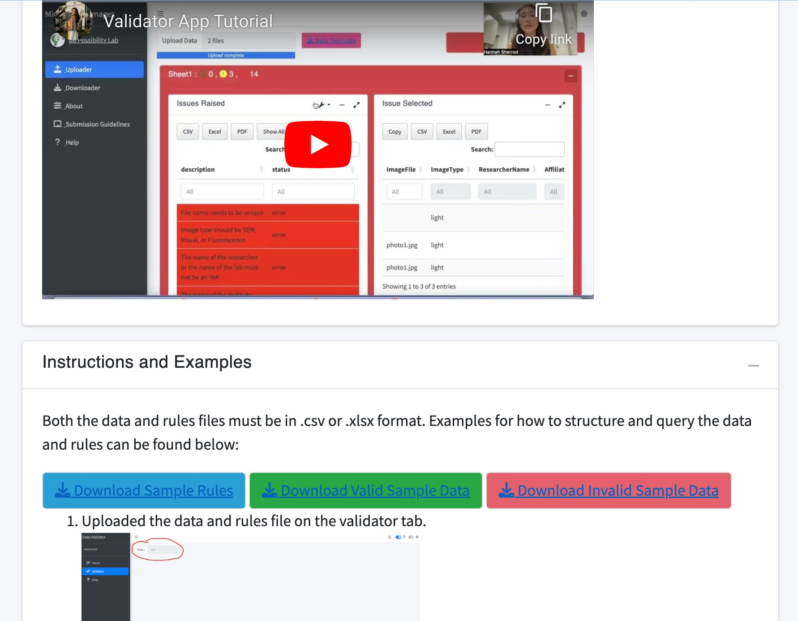
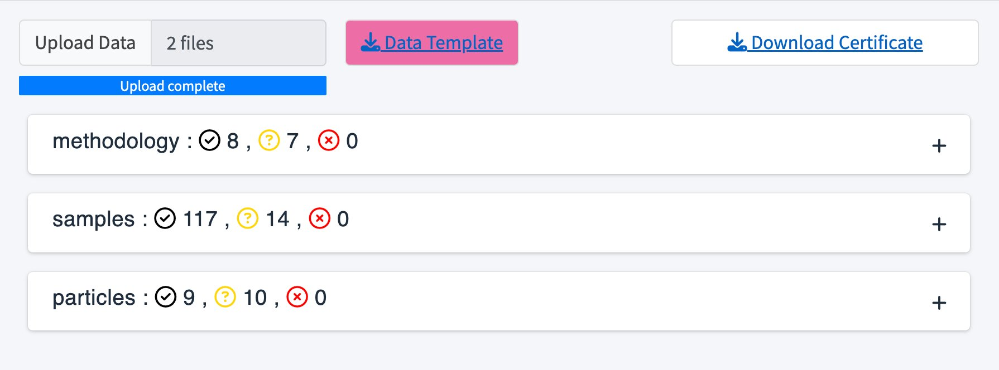
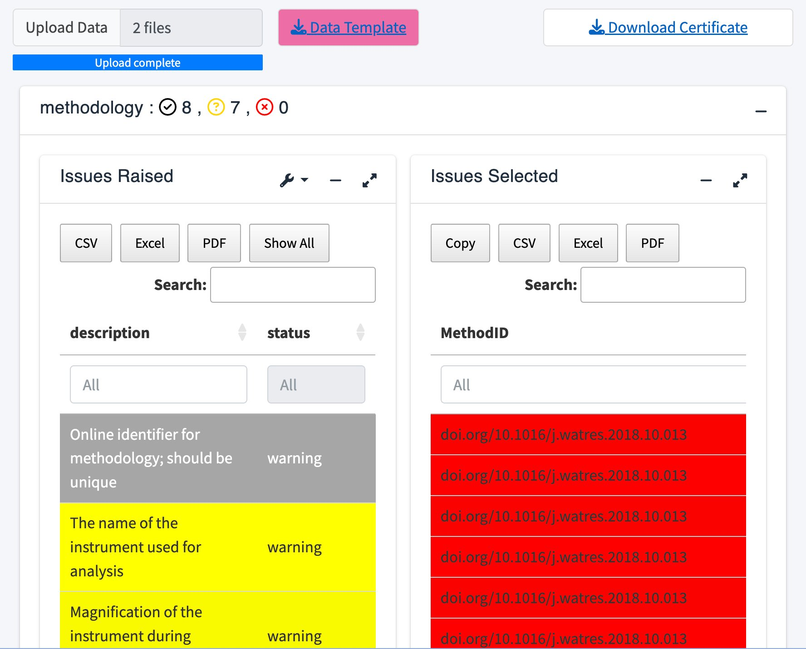
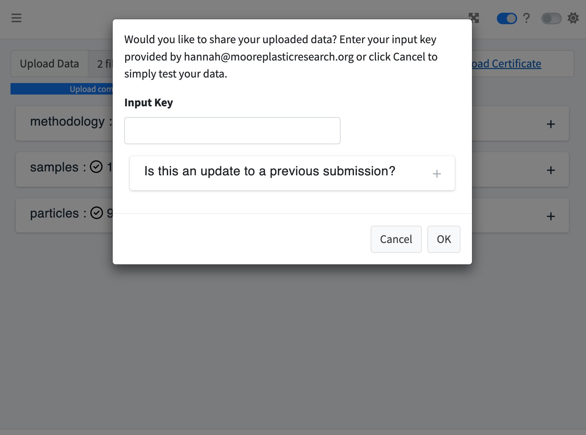

```{r, include = FALSE}
knitr::opts_chunk$set(
  collapse = TRUE,
  comment = "#>",
  warning = FALSE
)
```

## Document Overview

This document outlines a workflow to utilize the validator app from the One4All portal. After reading this document, users will have a better understanding of the processes involved in creating this app and how to navigate through it. The purpose of this tool is to not only validate, but to share and download data as well to the following cloud services: Amazon S3, CKAN, and/or MongoDB. For more documentation about the One4All R package, please see the [One4All Package Tutorial](package.html).

## Background: Rules

An existing set of rules created in 'Excel' is applied to the app and package to validate the uploaded data. The current rules sheet consists of six columns, including name, description, dataset, valid example, severity, and the rule itself (see below for more details). Additionally, users can structure their own rules sheet for their own purposes. Download the sample rules under the `'_Help'` tab in the validator app to view the current example rules.

**Name:** A placeholder for the rule. `'(ex. Amount)'`

**Description:** A description of the rule and its requirements. `'(ex. If there are two or more identical particles (in every aspect), upload it once and indicate the number of identical particles here as a whole number)'`

**Dataset:** Optional field when the file is separated into multiple sheets or files. `'(ex. partices; methodology; samples)'`

**Valid_example:** A valid example of the rule. `'(ex. 2)'`

**Severity:** The severity of the rule, labeled 'warning' or 'error'; invalid data will be marked as either a 'warning' or an 'error' depending on the severity of the rule. Data identified as a warning can be shared, whereas an error will need to be corrected and the files reuploaded before sharing. `'(ex. warning)'`

**Rule:** The rule that validates the data (written in r code). `'(ex. Amount >= 2 | is.na(Amount))'`

## Running the App

To access the validator app, go to this link [openanalysis.org/microplastic_data_portal/](https://openanalysis.org/microplastic_data_portal/) or go to our [GitHub](https://github.com/Moore-Institute-4-Plastic-Pollution-Res/One4All) and link it directly to your own device in R. After setting up the github to your device, go to the `'validator'` folder, select the global.R, ui.R, or server.R, and run the app.

If using the R package, read in the library and run the following command, `run_app()`.
```{r setup}
library(One4All)
```

```{r, eval=FALSE}
run_app()
```

## How to structure your data

Download the valid data example under the `'_Help'` tab within the app and adapt it for your own purposes. It is important that the columns of the data are the same as the rules sheet because each column in the data corresponds to a rule within the rules sheet. 

```{r, fig.align="center", echo=FALSE}

```

## Validating Data

Once the app is running, upload your data by selecting the 'Upload Data' icon and select from your 'CSV' or 'Excel' files along with a corresponding zip folder. Your data will then display as successes, warnings, or errors in the following tables. 

To view the details, click on a table which will then display two boxes, `'Issues Raised'` and `'Issues Selected'`. The `'Issues Raised'` box will highlight the warnings and errors. Click on an `'Issues Raised'` column and the invalid entries will then appear to the right in the `'Issues Selected'` box. To view all statuses, including successes, switch the tool toggle labeled `'Errors only?'` to off. 

```{r, fig.align="center", echo=FALSE}

```

```{r, fig.align="center", echo=FALSE}

```

## Sharing Data

Reupload the files after correcting any errors; errors must be corrected to validate the data, but warnings are allowed. 

If this is an update to a previous submission, upload the previous certificate from your local device. If this is a new submission, then follow the rest of the prompt on the screen. 

```{r, fig.align="center", echo=FALSE}

```

An input key is optional and should only be provided if required. If it is required, request one from the maintainer listed in the configuration file.

Once your data is successfully uploaded, a new screen, `'Successful Remote Data Sharing'`, will be displayed. Download the certificate in the top right corner to view the credentials of this dataset.

```{r, fig.align="center", echo=FALSE}

```

## Downloading Data

Download any previously uploaded data from the cloud services by providing a dataset ID from a downloaded certificate. Each dataset has its own ID, represented as a hash of numbers, so ensure that you provide the correct dataset ID for the data you are attempting to download.

```{r, fig.align="center", echo=FALSE}
knitr::include_graphics("appimages/DownloadDataValidator.jpg")
```
