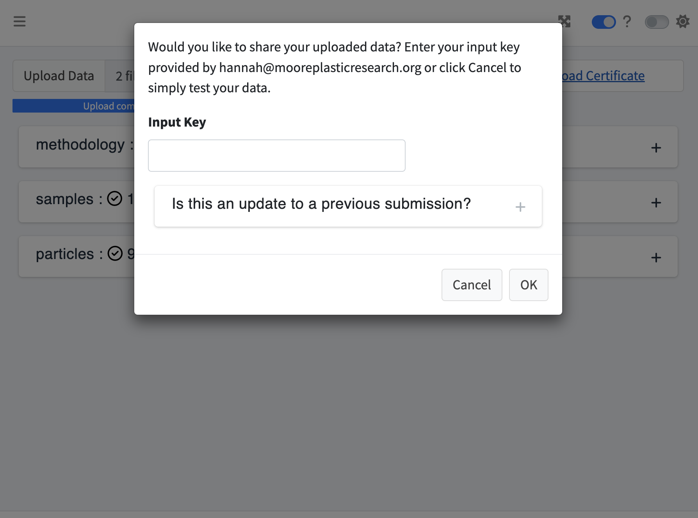
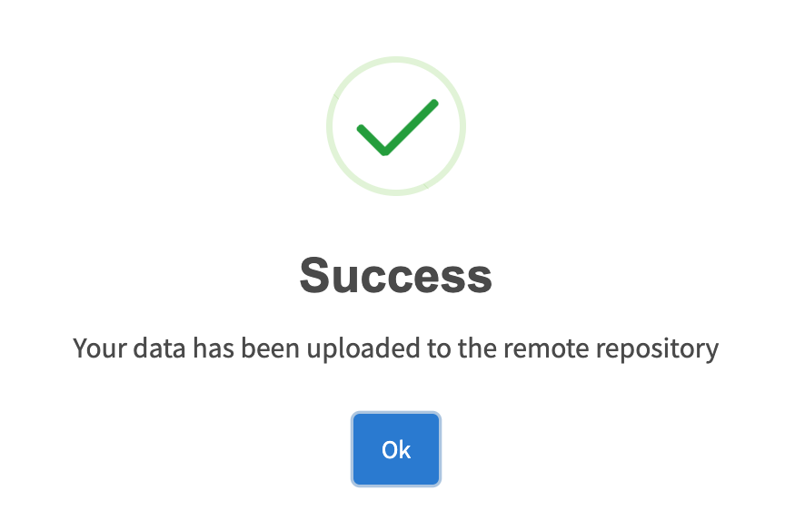
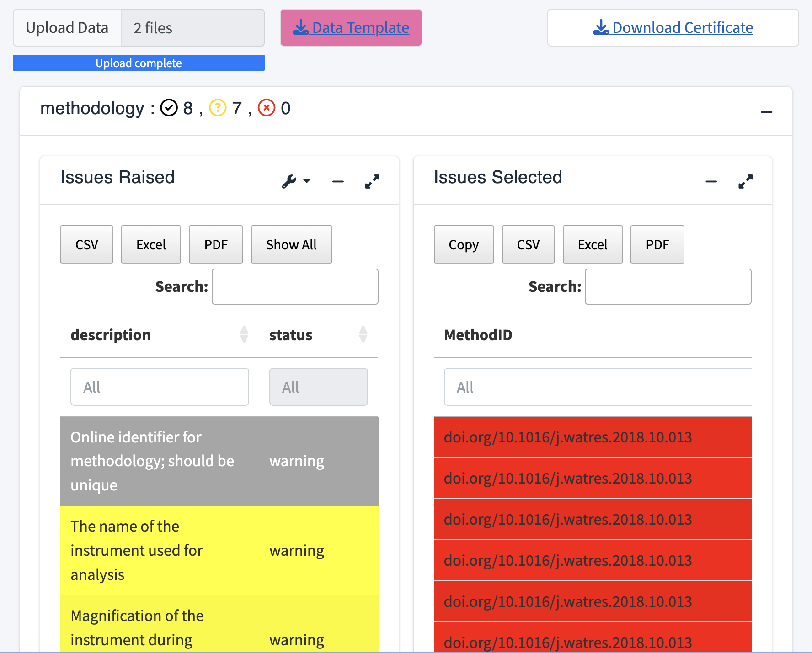

```{r, include = FALSE}
knitr::opts_chunk$set(
  collapse = TRUE,
  comment = "#>",
  warning = FALSE
)
```

## Document Overview

This document outlines a workflow to utilize the validator app from the Microplastics Data Portal. After reading this document, users will have a better understanding of the processes involved in creating this app and how to use it. The purpose of this tool is to not only validate data, but to share data as well, promoting open-source resources. For more documentation about the One4All R package, please see the [One4All Package Tutorial](package.html).

## Background: Rules

This section discusses how the app validates and shares data. First and foremost, there is an existing set of rules created in Excel that is applied to the validator app prior to user usage. These rules allow the app to validate the user's data once they've uploaded it to the app. The rules sheet consists of six columns, including name, description, dataset, valid example, severity, and the rule itself (see below for more details). Download the sample rules under the '_Help' tab in the validator app to view the rules.

**Name:** The name of the row. `'(ex. Amount)'`

**Description:** A description of the rule itself and its requirements. `'(ex. If there are two or more identical particles (in every aspect), upload it once and indicate the number of identical particles here as a whole number)'`

**Dataset:** Labeled 'particles', 'methodology', or 'samples'. `'(ex. partices)'`

**Valid_example:** A valid example of the rule. `'(ex. 2)'`

**Severity:** The severity of the rule, labeled either a 'warning' or an 'error'. Warnings will still allow the data to be shared, whereas an error will need to be fixed. `'(ex. warning)'`

**Rule:** The rule that validates the data (written in r code). `'(ex. Amount >= 2 | is.na(Amount))'`

## Running the App

To access the validator app, go to our [GitHub](https://github.com/Moore-Institute-4-Plastic-Pollution-Res/Microplastic_Data_Portal) and link it directly to your own device in R. After setting up the github to your device, go to the validator folder, select the global.R, ui.R, or server.R, and run the app.

If using the R package, read in the library and run the following command, `run_app()`.
```{r setup}
library(One4All)
```

```{r, eval=FALSE}
run_app()
```

## How to structure your data

Download the valid example data under the `'_Help'` tab within the app. To properly structure your data, keep the columns but replace the data with your own. It is important that the columns remain the same because each column corresponds to a rule from the rules sheet.

Although it is necessary for all of the columns to be present, the validator app encompasses a wide variety of data, so it is not a requirement for every column to have data. The columns that don't pertain to your dataset can be left blank.

```{r, fig.align="center", echo=FALSE}
knitr::include_graphics("appimages/RulesExampleValidator.png")
```

## Sharing Data

Once the app is loaded, upload your data by selecting the 'Upload Data' icon. Your local folder will display where you can select from your CSV or XLSX files along with a corresponding zip file. The validator app accepts data formats of CSV, XLSX, and zip files. After selecting the files, a screen will appear with the option to share your uploaded data. 

If this is an update to a previous submission, select that icon and upload the previous certificate from your local device. If this is a new submission, then follow the rest of the prompt on the screen. 

```{r, fig.align="center", echo=FALSE}

```

An input key is optional and should only be provided if required. If it is required, it will have been provided to you ahead of time by the maintainer. 

If your data was successfully uploaded, a new screen, `'Successful Remote Data Sharing'`, will display. If the data was not successfully uploaded, a separate screen will display showing the columns that were invalid. The `'Validating Data'` section below provides instructions on how to correct invalid data. Reupload the data once all errors have been corrected.

```{r, fig.align="center", echo=FALSE}

```

## Validating Data

If you simply want to validate your data, select cancel on the `'Would you like to share your uploaded data'` screen. Your data will display among three boxes- methodology, samples, and particles. Each of these tables will separate the columns from your data into successes, warnings, and errors. 

To view the details, click on a table which will then display two boxes, `'Issues Raised'` and `'Issues Selected'`. The `'Issues Raised'` box will highlight the warnings and errors in yellow or red, respectively. Click on an `'Issues Raised'` column and the entries that are invalid will appear to the right in the `'Issues Selected'` box. To view all statuses, including successes, switch the tool toggle labeled `'Errors only?'` off. 

```{r, fig.align="center", echo=FALSE}

```

```{r, fig.align="center", echo=FALSE}

```