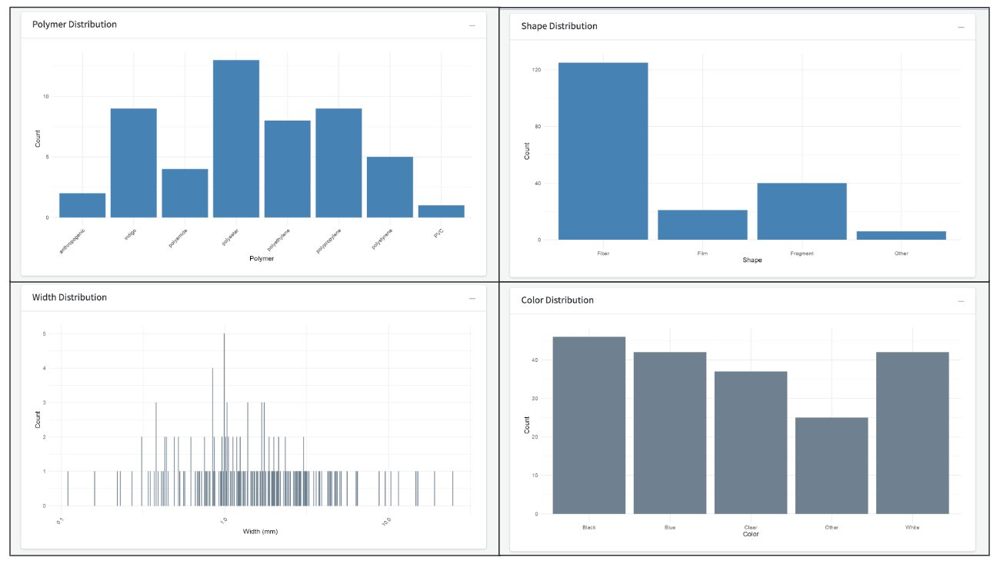

```{r, include = FALSE}
knitr::opts_chunk$set(
  collapse = TRUE,
  comment = "#>",
  warning = FALSE
)
```

## Document Overview

This document outlines a workflow to utilize the Data Visualization Tool from the One4All portal. After reading this document, users will have a better understanding of the processes involved in creating this app and how to navigate through it. The purpose of this tool is to analyze and interpret microplastics data using plots, tables, and maps. The `'Map By Raw Data'`, `'Map By Countries'`, and `'Other Visuals'` tabs use data from the California Open Data Portal. The `'CA Microplastic Synthetic Data'` uses synthetic data, which we aim to replace with data from the Validator tool.

## Running the App

To access the Data Visualization Tool, go to this link [openanalysis.org/microplastic_analysis/](https://openanalysis.org/microplastic_analysis/) or go to our [Github](https://github.com/Moore-Institute-4-Plastic-Pollution-Res/Microplastic_Data_Portal) and link it directly to your own device in R. After setting up the Github to your device, go to the `'data_visualization'` folder and select the app.R file to run the app.

```{r, fig.align="center", echo=FALSE}
knitr::include_graphics("appimages/DataVis1.jpg")
```

### Map By Raw Data, Map By Countries

The `'Map By Raw Data'` and `'Map By Countries'` tabs allow users to look at the concentration of microplastics by cities or countries. Users can select one or more locations, generating the following:

**Map:** The map displays the location(s) selected. Each marker represents a dataset at that location and includes the 'Latitude', 'Longitude', 'Source', and 'Concentration'.

```{r, fig.align="center", echo=FALSE}

```

**Plot:** The app generates a raincloud plot and displays the plastics by source (bottled or tap) and concentration (particles/L), based on the location(s) selected.

```{r, fig.align="center", echo=FALSE}

```

**Table:** For the selected location(s), data from the California Open Data Portal is displayed.

```{r, fig.align="center", echo=FALSE}
knitr::include_graphics("appimages/DataVisTable.jpg")
```

### Other Visuals

The `'Other Visuals'` tab allows users to compare the following microplastic characteristics from the data implemented in the tool: morphology, color, and material. Users will select the sankey plot they wish to view and the plot will generate the relationship between two of the characteristics.

```{r, fig.align="center", echo=FALSE}
knitr::include_graphics("appimages/DataVisSankey.jpg")
```

### CA Microplastic Synthetic Data

The `'CA Microplastic Synthetic Data'` tab utilizes data that is entirely simulated for illustrative purposes to demonstrate the functionality of the tool. Users can select various counties and cities within the state of California, displaying spatial, temporal, and attribute statistics as well as treatment levels.

```{r, fig.align="center", echo=FALSE}

```

```{r, fig.align="center", echo=FALSE}

```

```{r, fig.align="center", echo=FALSE}

```