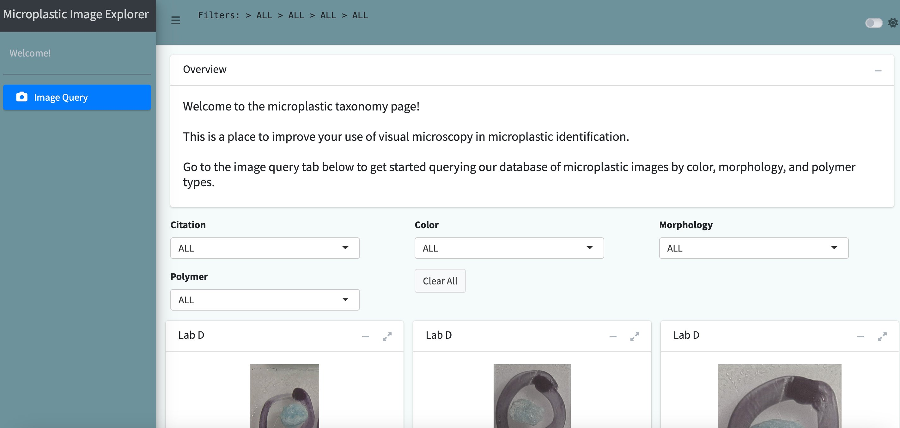
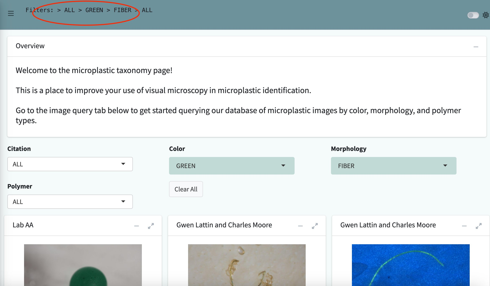
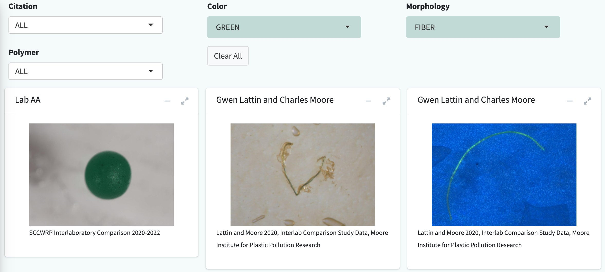

```{r, include = FALSE}
knitr::opts_chunk$set(
  collapse = TRUE,
  comment = "#>",
  warning = FALSE
)
```

## Document Overview

This document outlines a workflow to utilize the Microplastic Image Explorer from the One4All portal. After reading this document, users will have a better understanding of the processes involved in creating this app and how to navigate through it. The purpose of this tool is to allow users to improve their use of visual microscopy in microplastic identification by applying filters to query microplastic images.

## Running the App

To access the Image Explorer, go to this link [openanalysis.org/microplastic_image_explorer/](https://openanalysis.org/microplastic_image_explorer/) or go to our [Github](https://github.com/Moore-Institute-4-Plastic-Pollution-Res/Microplastic_Data_Portal) and link it directly to your own device in R. After setting up the Github to your device, go to the `'microplastic_image_explorer'` folder and select the app.R file to run the app.

```{r, fig.align="center", echo=FALSE}

```

Once the app has loaded, users can select between 'Citation', 'Color', 'Morphology', and 'Polymer' to query various microplastic images. The queried results will populate below, along with the breadcrumb filter at the top of the page which shows the filters that have been applied.

```{r, fig.align="center", echo=FALSE}

```

The filter options will update with each filter applied to ensure that only existing images can be queried.

```{r, fig.align="center", echo=FALSE}

```